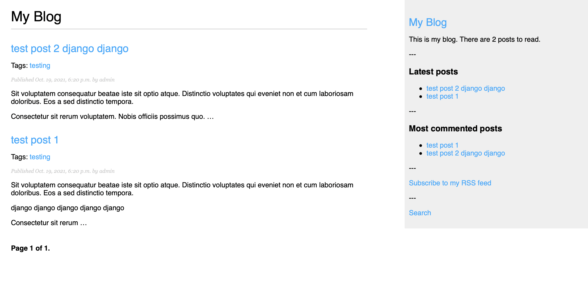

# django_blog

Just a simple blog made in Django.

## How to get running

Clone the repo

    git clone https://github.com/ephergent/django_blog.git

Change to the repo directory

    cd django_blog

Create a virtualenv

    virtualenv -p python3 venv

Activate the virtualenv

    source venv/bin/activate

Install the requirements

    pip install -r requirements.txt

Change in to the project directory

    cd mysite

#### Optional DB

https://docs.djangoproject.com/en/3.2/ref/settings/#databases

The site is set for a postgresql database backend and is expecting that.

Setup a Postgresql server and use the following to create your test database

    Postgresql Commands:

    Create the user and database, then give access to database
    CREATE USER blog WITH PASSWORD 'blog';
    CREATE DATABASE blog;
    GRANT ALL PRIVILEGES ON DATABASE blog to blog;

Edit `mysite/settings.py` starting at line 99 to add your DB settings.

OR

Comment out the Postgresql lines and uncomment the SQLlite DB lines 85-91 in order to just have a file based DB [Go with this if you are just testing]

Make migrations and migrate

    python manage.py makemigrations
    python manage.py migrate

If that works create a super user

    python manage.py createsuperuser

Run the dev server

    python manage.py runserver

Open your browser and look at the blog:

http://127.0.0.1:8000/

Expand and build upon this.

